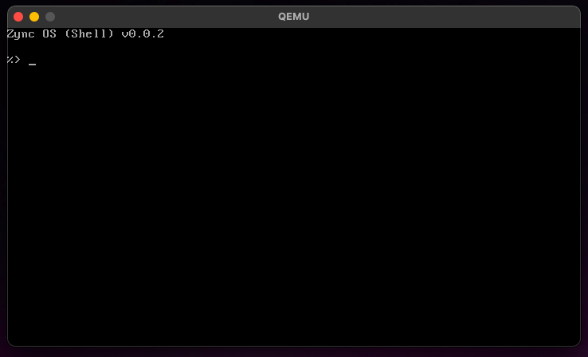

# Zync OS: Nothing Operating System

Zync OS is a mock-up bootloader-only dummy operating system. It has a very basic boring shell.

<p align="center">
    
</p>

## Getting Started

To build Zync OS, simply execute the following commands:

```zsh
git clone https://github.com/nthnn/Zync-OS.git && cd Zync-OS
mkdir dist
sudo chmod -R 777 *.sh
./build.sh
```

## License

Zync OS has no license, just don't claim it yours or something, y'know.